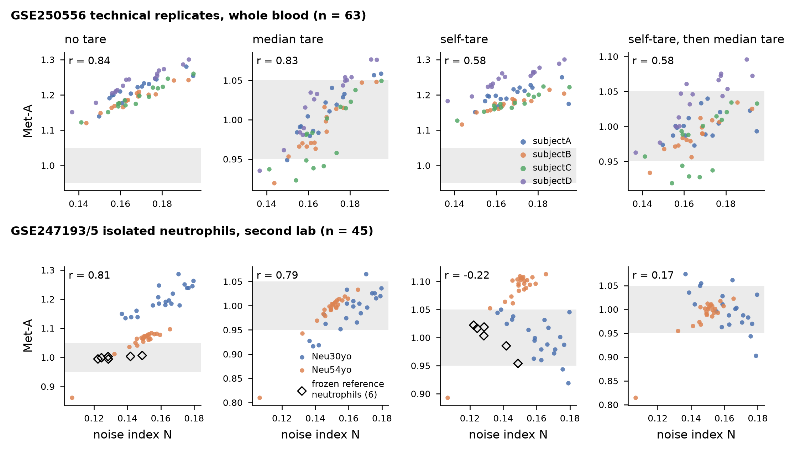

# DEV-SELFTARE-01 — the array tares itself from its own fixed sites (development note, 2026-10-03)

Development, not a test: nothing was set before reading, and nothing here changes the chain. `chain/conductor_v3.py` is unchanged;
the prototype is `doors/data/DEV_SELFTARE_01/dev_selftare_01.py`. Chain files read: repo HEAD d3165fe.

**What it shows.** The self-tare takes out part of the noise, not all of it. On the 63 replicates the within-person SD goes
0.036 → 0.027 (self-tare alone) and 0.037 → 0.032 (self-tare then median tare); the link to N drops from r 0.84 to 0.58.
But it moves the six clean reference arrays: their spread goes from 0.994–1.006 to 0.954–1.022. The fixed sites do not
predict the identity sites' noise one for one.

## 1. Derivation

Two-channel array. For one probe on one array: M = b·S + rM, U = (1 − b)·S + rU. Here b is the true methylated fraction,
S the probe's total signal, and rM, rU what lands in each channel without coming from the CpG (residual background,
cross-hybridisation, unconverted C). The chain's Stage 1 forms beta = M / (M + U) (methylprep noob, no offset; checked:
|M/(M+U) − chain beta| ≤ 0.0005 on every site).

1. **\derived** Write dU = rM / (S + rM + rU) and dM = rU / (S + rM + rU). Then exactly
   beta = b (1 − dU − dM) + dU. At a site whose true state is 0, beta = dU. At a true-1 site, 1 − beta = dM.
2. **\conjecture** The 48,528 fixed sites (`noise_sites_EPIC_v1.json`) have true state exactly 0 (40,882) or exactly 1 (7,646)
   on every array. State per site is taken from the 37 purified GSE110554 arrays (mean beta 0.009–0.031 or 0.973–0.992).
   If a fixed site's true state is 0.01 rather than 0, every array's dU carries the same extra 0.01.
3. **\derived** Mean inversion, per array and per probe design (I, II): b̂ = (beta − mean dU) / (1 − mean dU − mean dM).
   Uses only this array's fixed sites. Linear, so it does not need dU and dM to be independent.
4. **\calc** Entropy added by the offsets at true state b: I(b) = E[H(b(1 − dU − dM) + dU)] − H(b). The expectation is over
   this array's own fixed-site dU and dM (200 × 200 quantile grid, b on a 0.0025 grid). Assumes **\conjecture** dU and dM of
   one probe are independent (each fixed site shows only one of them).
5. Self-tared site entropy: H_st = H(beta) − I(b̂).
6. Met-A from H_st. Isolated: A_st = mean H_st / floor_st, where floor_st = 0.2347 is the mean H_st of the six frozen
   reference arrays (`metA_floors_v1_3.json` refs; chain floor 0.3303, recomputed here 0.3303). Whole blood:
   A_st = mean H_st / mean H(e*), with e* = (e − dU_ref) / (1 − dU_ref − dM_ref), e = Σ f_g μ_g (frozen profiles, this
   specimen's Stage-A fractions). dU_ref, dM_ref are the six reference arrays' mean offsets: type I 0.0186 / 0.0180,
   type II 0.0248 / 0.0236. **\conjecture** All frozen group profiles carry those offsets. Checked on the GSE110554 arrays:
   group means by design run 0.015–0.019 (I) and 0.021–0.025 (II).
7. Median tare as in the chain: A / median(A of the other arrays on the same slide), self excluded, ≥ 3 required.
   Nothing is fitted anywhere.

**\openprob — not seen by the fixed sites.**
- A gain difference between the two channels (M and U efficiency) gives beta ≈ b + b(1 − b)(gM − gU). That term is zero at
  b = 0 and b = 1, so fixed sites cannot measure it.
- **\calc** The design mismatch: the fixed sites are 99.7 % type I (40,827 + 7,553). Only 55 + 93 are type II.
  The identity sites are 97.9 % type II (5,876 of 6,000). The type II offset of each array therefore rests on 148 probes
  (standard error of mean dU about 0.0007).

## 2. What was run
- Box methylphys-cpu-01. Job e0a485f3: chain Stage 1 (`calibrate_idat_to_beta`) and untared `run_neutrophil` on 63 GSE250556 +
  37 purified GSE110554 arrays. The second-lab fetch in that job got an S3 redirect page; job 8a81a5d5 fetched GSE247193/5
  from S3 (`downloads/G_chain_tests/healthy_repeat/`) and ran their 48 arrays. Job 0311ee82 took noob M and U for variant B.
  Outputs: `/home/ubuntu/data/dev_selftare_01` and S3 `results/DEV_SELFTARE_01/`.
- Reproduction: untared A matches PROC-REPL-V3-01 pass 1 on all 63 (largest difference 0.0000; N identical). The median tare
  matches pass 2 within 0.0001. The 6 reference arrays read untared 0.994–1.006.
- GSM7981500 not run (Stage 0 quarantine, as before). Second lab: 3 arrays (GSM7885055, GSM7885062, GSM7885064) have fewer
  than 90 % of the 6,000 identity sites after the detection mask, so A is not formed (as in the chain). 45 readings.
- Second-lab median tare: the other arrays of the same series on the same slide (5–7 each; 3 slides per series). These are
  the same man at other times of day. RUN3 did not designate them as references.

## 3. Readings as measured

**GSE250556, 63 replicates (whole blood).** Within-person SD pooled over the four persons; Normal = 0.95–1.05.

| reading | median (range) | within-person SD | in Normal | r with N |
|---|---|---|---|---|
| (i) no tare | 1.205 (1.121–1.300) | 0.036 | 0 | 0.84 |
| (ii) median tare | 1.002 (0.920–1.077) | 0.037 | 48 | 0.83 |
| (iii) self-tare | 1.195 (1.116–1.300) | 0.027 | 0 | 0.58 |
| (iv) self-tare then median tare | 1.000 (0.919–1.096) | 0.032 | 50 | 0.58 |
| variant: type I offsets on every site, then median tare | 0.999 (0.926–1.078) | 0.029 | 53 | 0.65 |
| variant B: per-probe background (rM, rU = median channel intensity at fixed sites), then median tare | 1.002 (0.874–1.125) | 0.041 | 41 | 0.39 |

- The self-tare does not move the whole-blood level (1.20). That offset is not in the fixed sites.
- Per person, (iv): A 0.020, B 0.026, C 0.041, D 0.038.
- Within each person, the inflation the self-tare removes tracks the array's measured mean H at r 0.92. But it is about half
  as large: within-person SD 0.0067 removed vs 0.0144 present.
- The convolution in step 4 changes mean H by only 0.0002 beyond the mean inversion; the mean inversion carries nearly all of
  it (the mean-inversion rows are in the summary CSV).

**Six clean purified neutrophil arrays (frozen reference).**

| array | N | no tare | self-tare (read against the other five) |
|---|---|---|---|
| GSM2998021 | 0.142 | 1.003 | 0.985 (0.982) |
| GSM2998057 | 0.122 | 0.995 | 1.022 (1.027) |
| GSM2998116 | 0.124 | 0.999 | 1.017 (1.020) |
| GSM2998023 | 0.129 | 0.994 | 1.019 (1.023) |
| GSM2998143 | 0.128 | 1.003 | 1.003 (1.004) |
| GSM2998030 | 0.149 | 1.006 | 0.954 (0.945) |

Their measured mean H spans 0.0041. The inflation the self-tare assigns them spans 0.0199. The self-tare removes 27–33 % of
the identity-site entropy, so any error in the offset is magnified in the ratio. Variant I: 0.965–1.020. Variant B: 0.922–1.081.

**Second-lab isolated neutrophils, GSE247193 (30 y man) + GSE247195 (54 y man), 45 readings.** Within-SD is pooled over the
16 time points (2–3 arrays each).

| reading | median (range) | within-time-point SD | in Normal | r with N |
|---|---|---|---|---|
| no tare | 1.084 (0.862–1.286) | 0.047 | 3 | 0.81 |
| median tare | 0.999 (0.810–1.066) | 0.041 | 39 | 0.79 |
| self-tare | 1.052 (0.893–1.113) | 0.044 | 18 | −0.22 |
| self-tare then median tare | 1.001 (0.815–1.074) | 0.044 | 39 | 0.17 |
| variant I then median tare | 1.000 (0.851–1.061) | 0.031 | 43 | 0.67 |

| series | N median (range) | type II dU median | no tare | self-tare | self-tare then median tare |
|---|---|---|---|---|---|
| GSE247193, 21 | 0.163 (0.137–0.180) | 0.063 | 1.192 (1.135–1.286) | 1.000 (0.919–1.050), 18 Normal | 1.001, 16 Normal |
| GSE247195, 24 | 0.150 (0.107–0.166) | 0.025 | 1.069 (0.862–1.097) | 1.096 (0.893–1.113), 0 Normal | 1.000, 23 Normal |

- In the 30 y series, the type II offset is 2.5 times the reference arrays' (0.063 vs 0.025). The self-tare brings that
  series from 1.19 to 1.00.
- The 54 y series' offsets equal the reference arrays'. Its 1.07 is not in the fixed sites, and the self-tare enlarges it
  to 1.10, because the same excess sits on a smaller denominator.
- Per-array N, offsets, and every reading: `dev_selftare_01_readings.csv`.

## 4. Open (development)
1. **\openprob** Why the identity sites respond less than predicted on the clean arrays and more on the whole-blood replicates.
   Candidates: the type I / type II mismatch of the fixed sites; the channel-gain term (invisible at 0 and 1);
   intensity-dependent offsets (variant B, a constant background per probe class, makes it worse).
2. **\openprob** A fixed-site set with true state 0.5 in every cell, for example imprinting control regions (one parental
   allele methylated). It would measure the gain term on the array itself. Not built.
3. **\openprob** A type II fixed-site set large enough to set the type II offsets (148 probes now).
4. The whole-blood level (~1.20) and the 54 y series' 1.07 are not removed by any self-tare variant tried. The planned physical
   tare (fully methylated and fully unmethylated control DNA on every slide) stays the deployment route.

Files (`doors/data/DEV_SELFTARE_01/`): `dev_selftare_01.py` (prototype), `dev_selftare_01_readings.csv` (per array),
`dev_selftare_01_summary.csv`, `dev_selftare_01_inflation_curves.csv` (I(b) per array and design),
`dev_selftare_01_meta.json`, `fig_dev_selftare_01_A_vs_N.png`, and `box/` (Stage-1, subset and intensity scripts as run).
