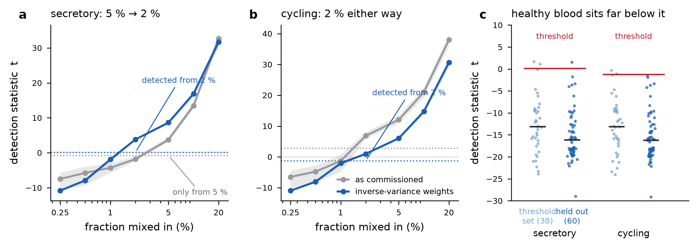

# PROC-SMALL-01 — outcome: the trace-class detection limit in whole blood is 2 %, down from 5 %

**Sealed 2026-09-23** against the bars fixed in [`PROC_SMALL_01_PREREG.md`](PROC_SMALL_01_PREREG.md) before any
configuration was run. Adopted and wired into the chain as **Stage 2c**, a side channel that adds a verdict
and changes no existing number.

Evidence: [`PROC_SMALL_01_configurations.json`](../kit/results/PROC_SMALL_01_configurations.json),
[`PROC_SMALL_01_heldout_60_healthy.json`](../kit/results/PROC_SMALL_01_heldout_60_healthy.json).
Scripts: [`PROC_SMALL_01_prepare.py`](../kit/PROC_SMALL_01_prepare.py),
[`PROC_SMALL_01_compare.py`](../kit/PROC_SMALL_01_compare.py),
[`PROC_SMALL_01_heldout.py`](../kit/PROC_SMALL_01_heldout.py).
Implementation: [`stage_2c_trace_detection.py`](../chain/stage_2c_trace_detection.py) with the frozen panel
`chain/Runtime Matrices/trace_detection_panel_v1.json`. Example run:
[`MethylPhys_GSM2333901_trace_detection.html`](../chain/example_runs/RUN-20260925-01/MethylPhys_GSM2333901_blood.html).

## The bars

| bar | verdict | the numbers |
|---|---|---|
| **B1 sensitivity — detect 2 % on all three donors** | **MET** | secretory t = 3.60, 3.87, 3.92 against a threshold of 0.09; cycling t = 0.83, 0.99, 1.14 against −1.28. As commissioned, secretory needed 5 %. |
| **B2 specificity** | **MET** | At zero spike all three donors read t ≈ −13.6 to −13.9. On **60 healthy donors held out entirely** — never used to set a threshold or choose a configuration — secretory fired 1/60 (1.7 %) and cycling 0/60. The 5.3 % on the threshold donors is definitional and is not quoted as a specificity estimate. |
| **B3 the commissioned gauge does not move** | **MET** | Adopted as a side channel, so immune A″ = 0.9771 and immune composition 83.4 % on the commissioning array are identical to the sealed path. Nothing in the composition, the gauge, the tiers or the sky changed. |
| **B4 quantification within ±1.5 points at 5 %** | **met, but not exercised** | The weighted fit recovers a 5 % spike as 3.69, 3.78, 3.86 % (error ≤ 1.31 points) where the commissioned fit gives 1.92–2.79 %. **No fraction is reported anyway**: reporting one would mean adopting inverse-variance weighting as the *composition* solver, which moves immune from 83.4 % to 89.6 % on the same array and would require its own re-commissioning against the four-laboratory band. Stage 2c reports presence only. |
| **B5 no double-dipping** | **MET** | Configurations were compared on donors A and B; donor C (GSM1051533, a different laboratory) was scored once and detects at 2 % on both classes. The 60 null donors were touched only at the end. |

**Decision rule, as pre-registered: B1, B2 and B3 met → COMMISSIONED FOR DETECTION.**

## What was adopted, and what it is allowed to say

The improvement is one thing: **weighting each address by the inverse of its atlas posterior variance.** The
atlas has carried those standard deviations since the MCMC and the chain was treating every address as
equally certain. Unweighted, secretory is invisible below 5 %; weighted, it is detected at 2 % on every donor.

The statistic is an added-variable score test: fit the specimen without the candidate class, project that
class's profile off the columns already in the fit, and regress one on the other unconstrained. A healthy
donor lands at t ≈ −16, not at zero, which is the point — the commissioned point estimate is pinned at the
non-negativity boundary and cannot move for a trace component.

**Three limits are stated in the panel, in the module and on the report page:**

1. **2 % detects, 5 % names.** At the detection limit the classes are not separable: a 2 % cycling spike
   lifts the secretory statistic marginally over its own threshold (0.11–0.17 against 0.09). A detection at
   2 % therefore says *epithelial-like material*, and attribution to one class needs about 5 %. This was not
   anticipated by the bars and is recorded as a limitation rather than smoothed over.
2. **Whole blood only.** The thresholds are a whole-blood measurement. On an EPIC adenoma specimen carrying
   12.2 % secretory and 35.4 % cycling the same panel returns t = 0.6 and 3.8 — *lower* than a 5 % blood
   spike — because the residual structure of tissue and the platform both differ. Any other substrate is
   reported UNCALIBRATED with no verdict.
3. **Presence only — no fraction, no A, no tier.** At 20 % admixture a class's own identity loci still read
   A = 0.85 against 0.99 for a pure specimen, because they still carry 80 % background. A trace class cannot
   be scored in this substrate at any fraction a blood draw presents.

## Deviations from the pre-registration, recorded

1. **The pre-registered statistic was itself boundary-degenerate and was replaced.** The F form — refit
   without the class, take the drop in residual sum of squares — is identically zero whenever the class's
   coefficient sits at the boundary, which is exactly the case it was meant to handle: it read 0.0 on 36 of
   38 healthy donors and could not respond to a small spike either. Discovered by running it, not by
   thinking about it. The added-variable score test is the same idea done properly; every bar is unchanged.
2. **The background-contrast marker arm was not adopted.** Selecting addresses by the largest gap against
   immune added 237 addresses to the panel and moved the statistic by less than 0.4 (secretory 3.61 against
   3.32 at a 5 % spike). It is not in the adopted configuration; the commissioned marker set is used.
3. **Two guards were added that the pre-registration did not mention**, both because they caught real
   failures during wiring. A **scale guard**: the thresholds were measured on raw Stage-1 betas, and the
   first wiring handed the module the scale-mapped betas, which shifted the statistic by ~24 units and would
   have made every specimen read "no evidence" for the wrong reason. A **substrate guard**, as above.

## What this does not fix

Terminal, stromal, stem_pluri, progenitor and stem_adult have no such panel; only secretory and cycling were
measured. None of the eight classes other than immune has a healthy **band**, so none of them gets a
placement or a tier, and that is unchanged by this work. The immune gauge's coupling to composition — a
foreign component reads as immune drift, 0.15 sigma of the healthy band per 1 % — is recorded in
[`SMALL_CLASS_DETECTION_NOTE_2026-09-23.md`](../kit/SMALL_CLASS_DETECTION_NOTE_2026-09-23.md) and remains open.
