# The report, tab by tab - the operating reference

**Generated** by [`build_report_tab_reference.py`](../kit/build_report_tab_reference.py) from `../../../results/e2e_final/REPORT.html` at commit `bbb8a18`. Not written by hand: a tab list written by hand goes stale the first time a tab is added, which happened twice in September. Re-run it after any change to the report builder.

One run produces **one self-contained HTML file of 7.42 MB with 19 tabs** - 9 carrying this specimen's own measurements and 10 carrying reference material that is identical in every report. The distinction matters: a reference tab tells you how the instrument works, and only a specimen tab tells you anything about the patient.

## The figures

These are **not browser screenshots.** A headless browser cannot be installed in the build environment (Quick Look is sandboxed off and the Playwright download resolves to a denylisted host), so each figure is rendered from that tab's own HTML - its headings and prose, in the report's palette - and says so in its caption. To replace one with a real screenshot, put a PNG named `<tab>.png` in `manual/report_screenshots/` and re-run this script; it prefers it.

## Every tab

### Reading  ·  `reading`  ·  SPECIMEN

The reading itself: the class gauge value, where it sits against the healthy band for this age, its tier word, and the composition that produced it. If a clinician reads one tab, it is this one.

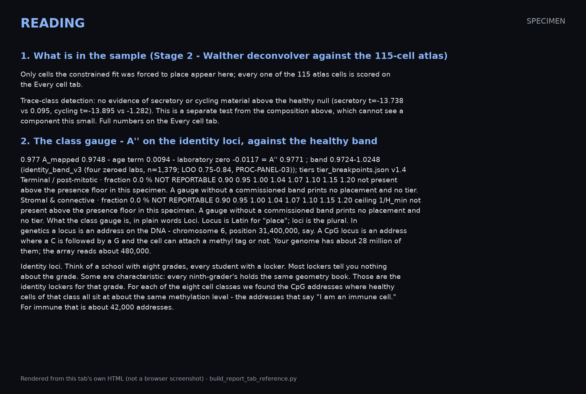

*27 KB, 4 tables, 24 rows.*  Sections: **Reading - GSM2333901**, **1. What is in the sample (Stage 2 - Walther deconvolver against the 115-cell atlas)**, **2. The class gauge - A'' on the identity loci, against the healthy band**, **What the class gauge is, in plain words**, **Is this composition plausible? Measured across 40 healthy donors of this laboratory**

### How to read  ·  `howto`  ·  REFERENCE

How to read the report: what each number means, what it does not mean, and the vocabulary the chain is allowed to use.

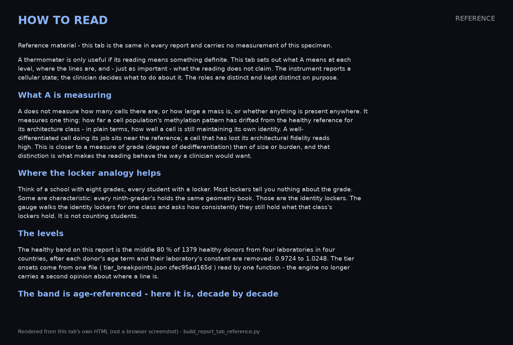

*633 KB, 4 tables, 29 rows.*  Sections: **How to read the gauge**, **What A is measuring**, **Where the locker analogy helps**, **The levels**, **The band is age-referenced - here it is, decade by decade**, **Three different things, and none of them is A = 1.00 sitting on a floor**, **The saturation wall chart - 8 classes x 5 substrates**, **The Warburg line at 1.07**

### Cells  ·  `cells`  ·  SPECIMEN

Every atlas cell type scored for this specimen - all of them, placed or not - each with its 95 per cent interval, the healthy range on its own markers, how many of its markers were found, and its position against healthy.

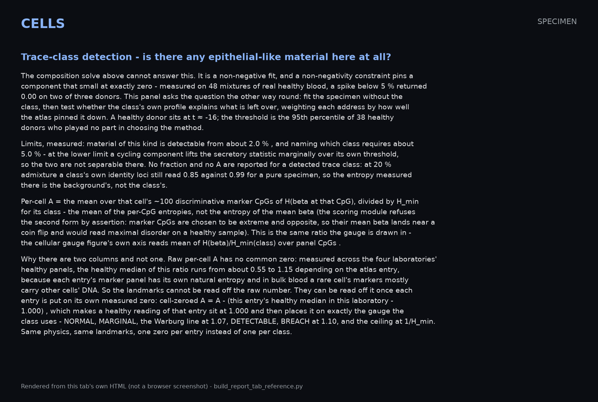

*91 KB, 11 tables, 143 rows.*  Sections: **Every cell - all 115 atlas cell types, on the gauge**, **Trace-class detection - is there any epithelial-like material here at all?**, **Two different limits on a per-cell claim, and they are not the same limit**, **Stem (pluripotent) (1 cells; H_min 0.9822)**, **Stem (adult) (1 cells; H_min 0.8737)**, **Progenitor (11 cells; H_min 0.8522)**, **Cycling epithelial (19 cells; H_min 0.8561)**, **Secretory / glandular (18 cells; H_min 0.8433)**

### Departure  ·  `departure`  ·  SPECIMEN

How far this specimen sits from the healthy centre in the banded space, which axes drove it, the patient value against the age-matched mean and the sigma used, and this laboratory's own measured false-alarm rate beside them.

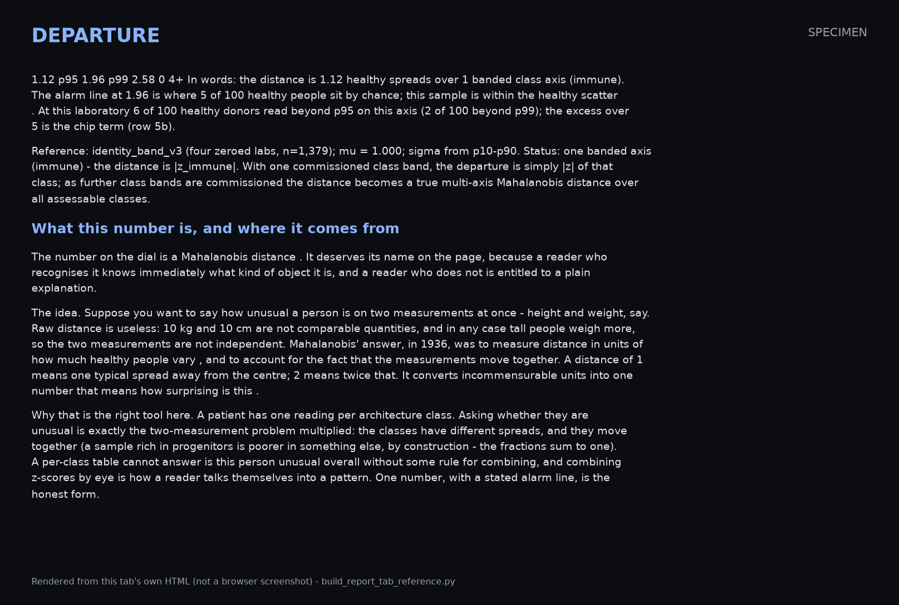

*4 KB, 1 tables, 2 rows.*  Sections: **Departure - how far this sample sits from the healthy centre**, **What this number is, and where it comes from**

### Sky  ·  `sky`  ·  SPECIMEN

The residual sky: a Mollweide plate of this specimen's own residuals, per class, plus the statistics behind each plate. Opens with what a plate is compared to, because it is never compared to a healthy picture.

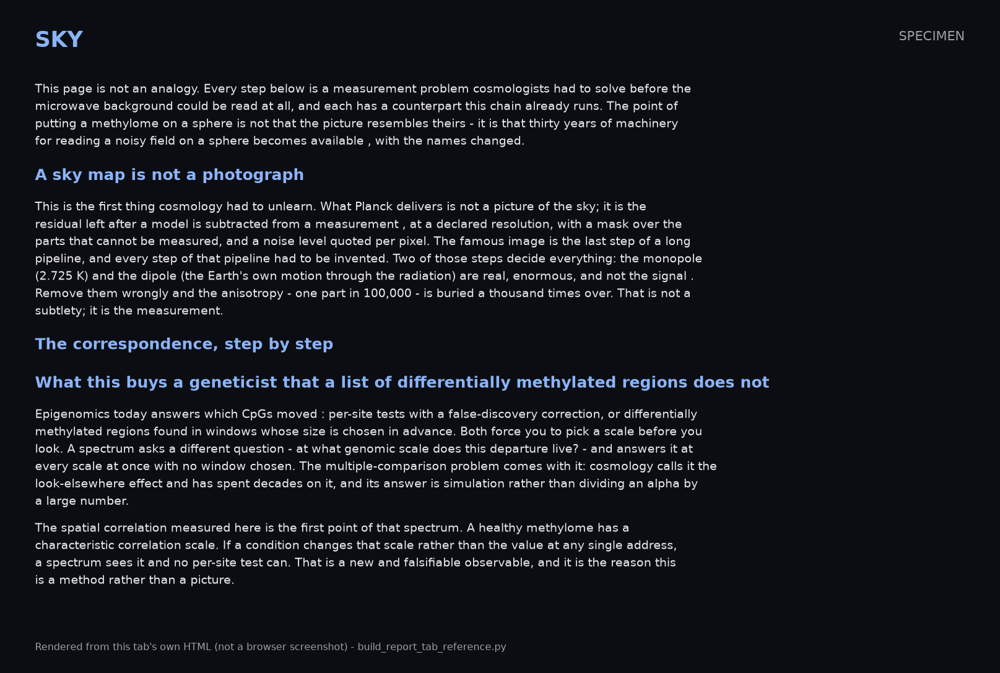

*5998 KB, 3 tables, 23 rows.*  Sections: **The sky - what it is, why it is a cosmologist's object, and what it buys a geneticist**, **A sky map is not a photograph**, **The correspondence, step by step**, **What this buys a geneticist that a list of differentially methylated regions does not**, **One thing a geneticist has that a cosmologist would trade almost anything for**, **What else the MCMC gives us, and what we are not yet using**, **Brilliance - the first tool taken from cosmology, and where it went**, **Two maps from one patient - the difference map**

### Physics  ·  `physics`  ·  REFERENCE

The physics under the gauge: Landauer's bound, the Mahaffey number, the entropy floor and why the zero is fixed rather than a control group.

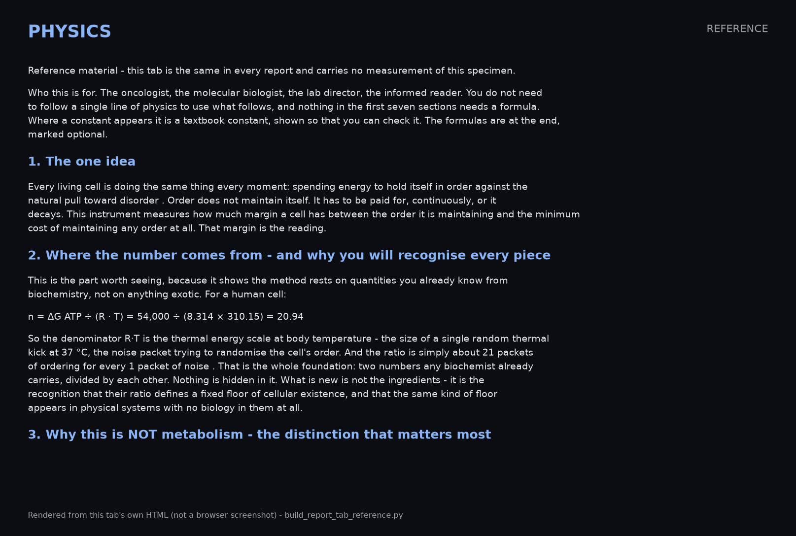

*18 KB, 4 tables, 16 rows.*  Sections: **The physics, in plain language**, **1. The one idea**, **2. Where the number comes from - and why you will recognise every piece**, **3. Why this is NOT metabolism - the distinction that matters most**, **4. Three things, not two**, **5. Eight sandcastles on one beach**, **6. Tidiness has a number, and the reading is a ratio**, **7. The same floor appears far outside biology - which is why we trust it**

### Story  ·  `story`  ·  REFERENCE

What astro-genetics is, in the author's words - the introduction that now also opens Issue 003.

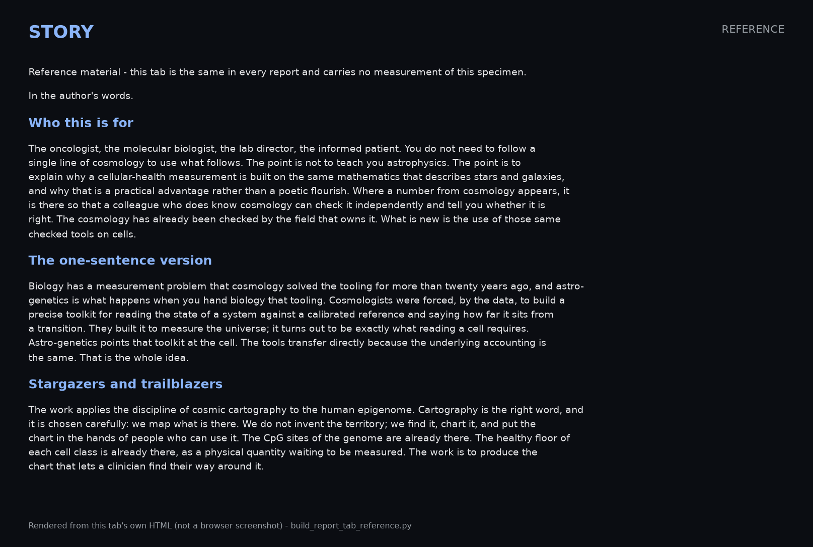

*379 KB, 0 tables, 0 rows.*  Sections: **What is astro-genetics?**, **Who this is for**, **The one-sentence version**, **Stargazers and trailblazers**, **Why your cells follow the same rule as the stars**, **The ceiling is informational, not gravitational - and that is why it travels**, **Where the gauge sits, and what is open to inspection**, **Two names, and which is which**

### Reference  ·  `reference`  ·  REFERENCE

Every constant the reading was corrected by, with where each came from - the floor, the age term, the laboratory zero, the scale map, and the calibration DOI.

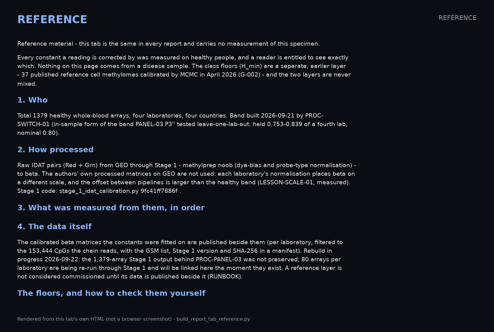

*9 KB, 2 tables, 14 rows.*  Sections: **The healthy reference - who, how many, processed how, and what was measured from them**, **1. Who**, **2. How processed**, **3. What was measured from them, in order**, **4. The data itself**, **The floors, and how to check them yourself**, **5. What is NOT in the reference**

### Coverage  ·  `coverage`  ·  SPECIMEN

What was measurable on this specimen's platform and what was not: marker coverage per class, and which atlas entries the array could not reach.

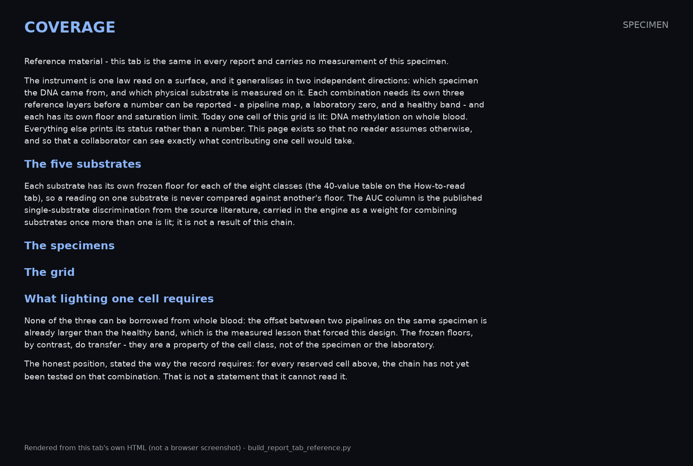

*7 KB, 3 tables, 22 rows.*  Sections: **Coverage - what is lit, what is reserved, and what each one needs**, **The five substrates**, **The specimens**, **The grid**, **What lighting one cell requires**

### Red flags  ·  `flags`  ·  SPECIMEN

Red flags: everything this run refused, withheld or could not measure, in one place, ordered by severity - STOP, WITHHELD, CAUTION, NOTE. A failing CMB tool arrives here as CMB_TOOL_FAIL.

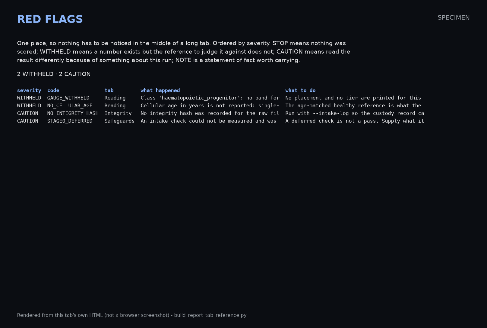

*3 KB, 1 tables, 5 rows.*  Sections: **Red flags - everything this run refused, withheld or could not measure**

### Safeguards  ·  `safeguards`  ·  SPECIMEN

Every guard and whether it passed on this specimen, including the register of all 17 methods borrowed from CMB analysis with PASS, FAIL, NOT_RUN, NOT_APPLICABLE or NOT_BUILT for this run.

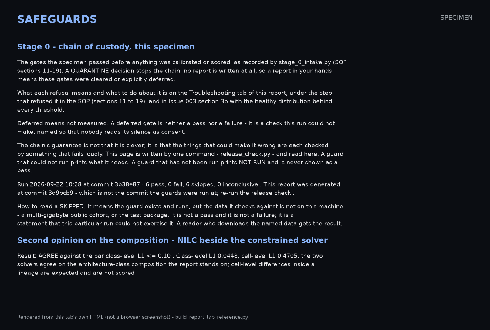

*17 KB, 4 tables, 55 rows.*  Sections: **Safeguards - every guard, and whether it passed**, **Stage 0 - chain of custody, this specimen**, **Second opinion on the composition - NILC beside the constrained solver**, **The cosmology toolkit, and what it did on this specimen**

### Troubleshooting  ·  `trouble`  ·  REFERENCE

Troubleshooting: every refusal string the chain can print, what it means, and what the operator does about it.

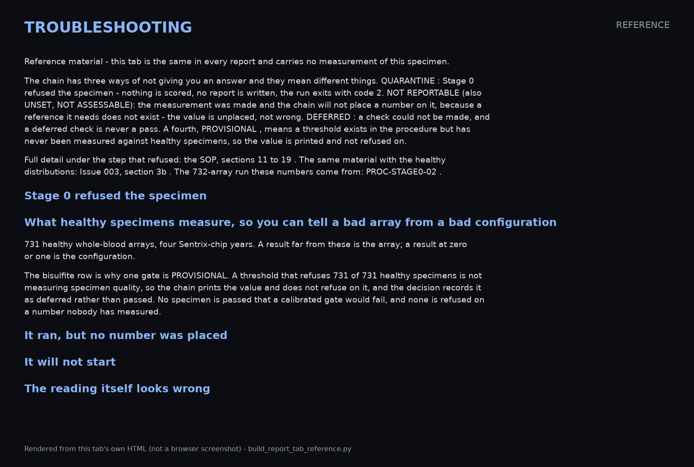

*9 KB, 4 tables, 31 rows.*  Sections: **Troubleshooting - what each refusal means, and what to do**, **Stage 0 refused the specimen**, **What healthy specimens measure, so you can tell a bad array from a bad configuration**, **It ran, but no number was placed**, **It will not start**, **The reading itself looks wrong**, **How these were found, which is how to look for yours**

### Integrity  ·  `integrity`  ·  SPECIMEN

The fail-safes that kept this reading honest: the Stage 0 custody record for this specimen, both file hashes, and each intake gate's own result.

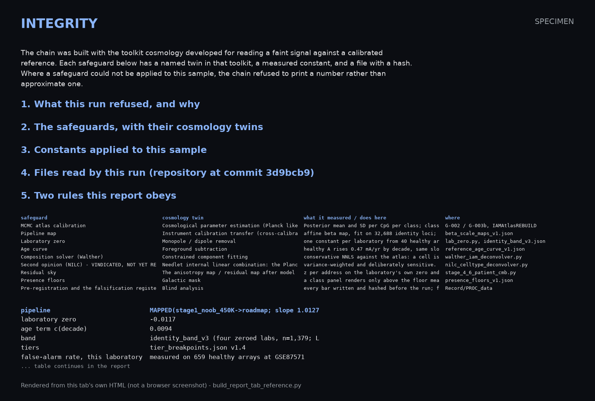

*18 KB, 3 tables, 64 rows.*  Sections: **Integrity - the fail-safes that kept this reading honest, and what each one measured**, **1. What this run refused, and why**, **2. The safeguards, with their cosmology twins**, **3. Constants applied to this sample**, **4. Files read by this run (repository at commit 3d9bcb9)**, **5. Two rules this report obeys**

### Chain  ·  `chain`  ·  REFERENCE

The chain that produced the reading, stage by stage, derived from the code rather than described - so a stage cannot be claimed that the code does not call.

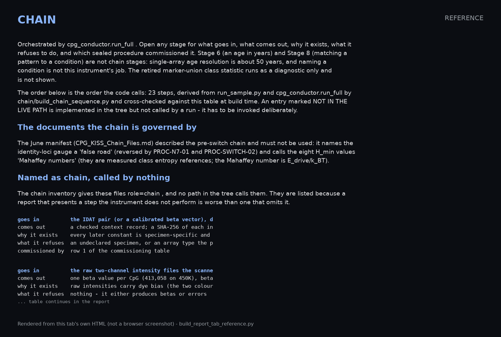

*29 KB, 21 tables, 105 rows.*  Sections: **The chain - every stage this report came from**, **The documents the chain is governed by**, **Named as chain, called by nothing**

### Files  ·  `files`  ·  REFERENCE

Every file the chain uses, enumerated from the live tree with its role.

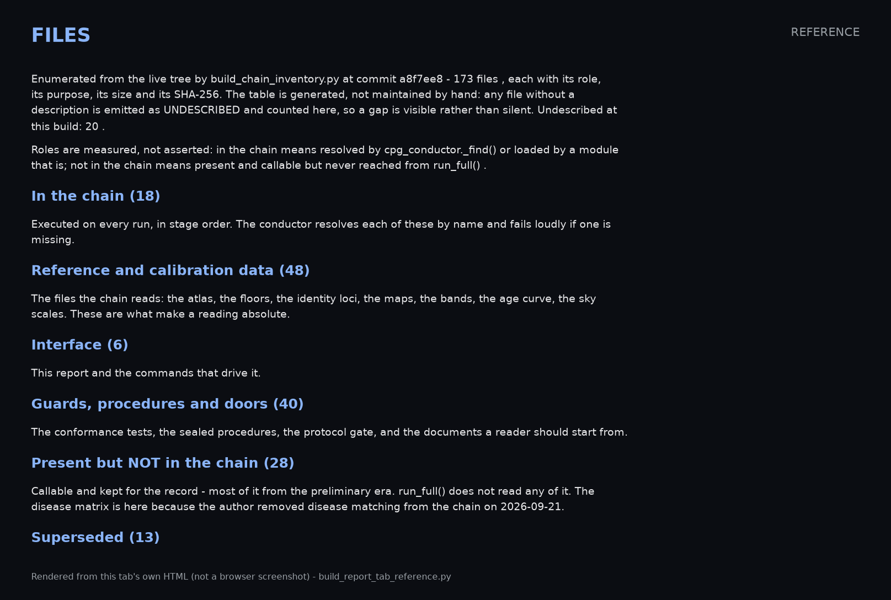

*67 KB, 6 tables, 159 rows.*  Sections: **Every file the chain uses**, **In the chain (18)**, **Reference and calibration data (48)**, **Interface (6)**, **Guards, procedures and doors (40)**, **Present but NOT in the chain (28)**, **Superseded (13)**

### Findings  ·  `findings`  ·  REFERENCE

Findings that changed a reported number, with the procedure that sealed each.

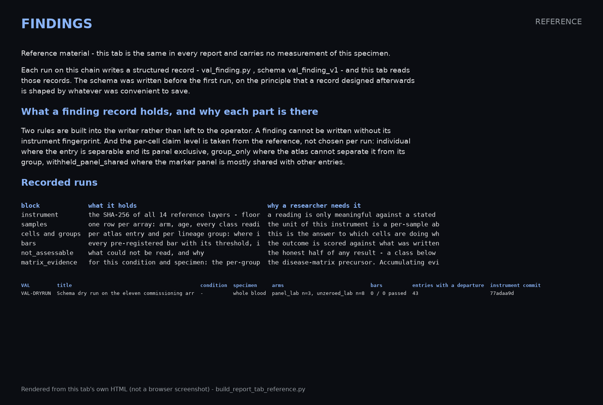

*12 KB, 3 tables, 53 rows.*  Sections: **Validation findings**, **What a finding record holds, and why each part is there**, **Recorded runs**

### Roadmap  ·  `roadmap`  ·  REFERENCE

What is not built yet and what it would buy - the same list ENHANCEMENTS.md ranks.

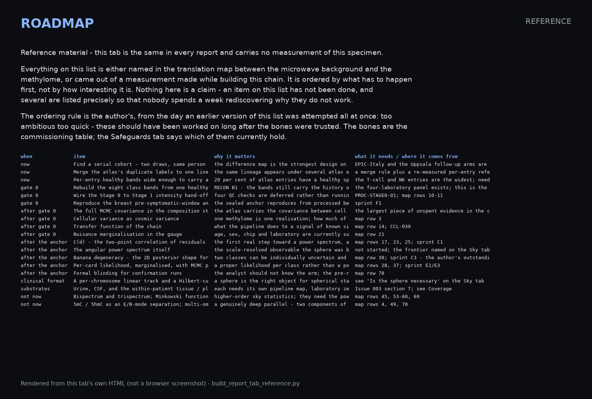

*8 KB, 1 tables, 21 rows.*  Sections: **What is being considered next**

### Record  ·  `record`  ·  REFERENCE

The validation record: every series and what it found.

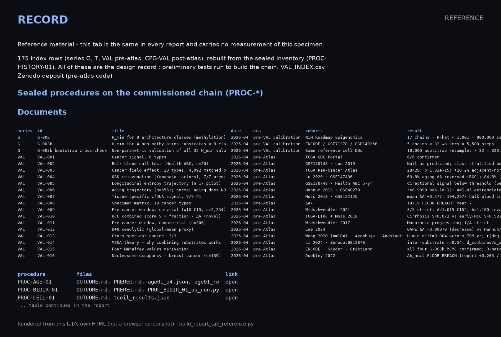

*52 KB, 2 tables, 200 rows.*  Sections: **Record - every validation and every sealed procedure, linked**, **Sealed procedures on the commissioned chain (PROC-*)**, **Documents**

### Run  ·  `run`  ·  SPECIMEN

How to run it yourself, what produced this reading (chain commit, decoder version, a hash of every input read), and whether every derived document was current when this report was built.

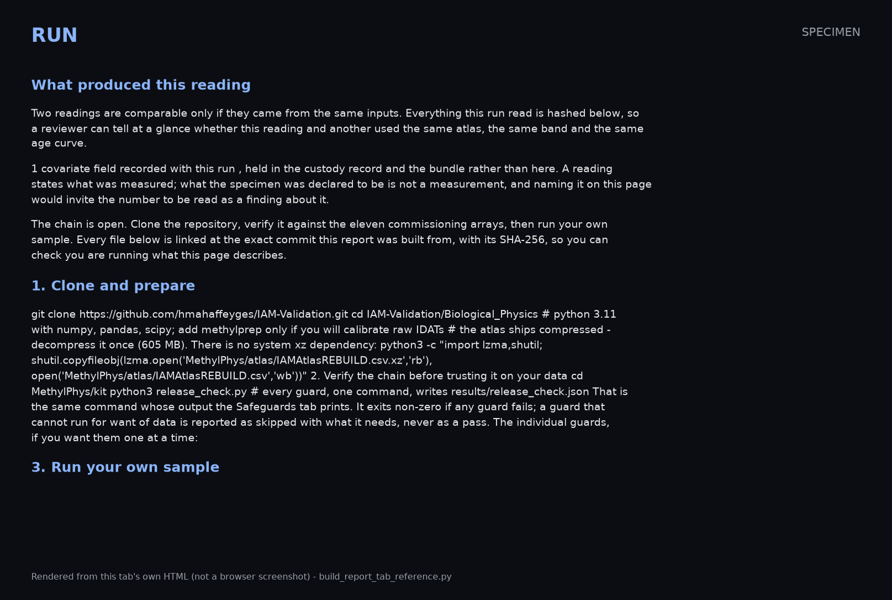

*16 KB, 6 tables, 58 rows.*  Sections: **Run it yourself**, **What produced this reading**, **1. Clone and prepare**, **2. Verify the chain before trusting it on your data**, **3. Run your own sample**, **4. What the chain needs from you, and what it will refuse**, **5. Commissioning your own laboratory**, **6. Cohort mode**

## The CMB tool register, as it reads on this specimen

Every method borrowed from CMB analysis, with a check that runs on the finished bundle. A FAIL is also emitted to Red flags as `CMB_TOOL_FAIL`. **NOT_BUILT entries are listed on purpose** - the shelf is part of the record, and [`ENHANCEMENTS.md`](ENHANCEMENTS.md) ranks them.

| state | method |
|---|---|
| `NOT_BUILT` | angular power spectrum of the residual sky |
| `NOT_BUILT` | apodised mask instead of a binary presence floor |
| `NOT_BUILT` | beam smoothing |
| `NOT_BUILT` | cross-spectra between class panels |
| `NOT_BUILT` | degeneracy and Fisher analysis of the composition |
| `NOT_BUILT` | difference map between two draws |
| `NOT_BUILT` | full cell-type covariance in the separation |
| `NOT_BUILT` | internal linear combination on the residual sky |
| `NOT_BUILT` | per-patient posterior for the composition |
| `NOT_RUN` | surface brightness |
| `PASS` | HEALPix pixelisation |
| `PASS` | Mahalanobis distance in the banded space |
| `PASS` | Mollweide plate of the residual sky |
| `PASS` | inverse-variance weighting |
| `PASS` | masking what the instrument cannot see |
| `PASS` | needlet internal linear combination |
| `PASS` | residual against a measured zero and scale |

To add a tool: append one entry to `TOOLS` in [`cmb_tools.py`](../chain/cmb_tools.py) with a `check(bundle)`. The table, the counts and the red-flag routing all follow.
