# The report, tab by tab - the operating reference

**Generated** by [`build_report_tab_reference.py`](../kit/build_report_tab_reference.py) from `kit/results/reference_report/reference.html` at commit `5f8704d`. Not written by hand: a tab list written by hand goes stale the first time a tab is added, which happened twice in September. Re-run it after any change to the report builder.

One run produces **one self-contained HTML file of 6.49 MB with 17 tabs** - 7 carrying this specimen's own measurements and 10 carrying reference material that is identical in every report. The distinction matters: a reference tab tells you how the instrument works, and only a specimen tab tells you anything about the patient.

## The figures

These are **not browser screenshots.** A headless browser cannot be installed in the build environment (Quick Look is sandboxed off and the Playwright download resolves to a denylisted host), so each figure is rendered from that tab's own HTML - its headings and prose, in the report's palette - and says so in its caption. To replace one with a real screenshot, put a PNG named `<tab>.png` in `manual/report_screenshots/` and re-run this script; it prefers it.

## Every tab

### Reading  ·  `reading`  ·  SPECIMEN

The reading itself: what is in the sample and how each cell reads - every present cell's A = H/H_min on its own identity loci against the fixed point 1.00, with its tier word; any foreign cell detected; and the instrument that took the reading. If a clinician reads one tab, it is this one.

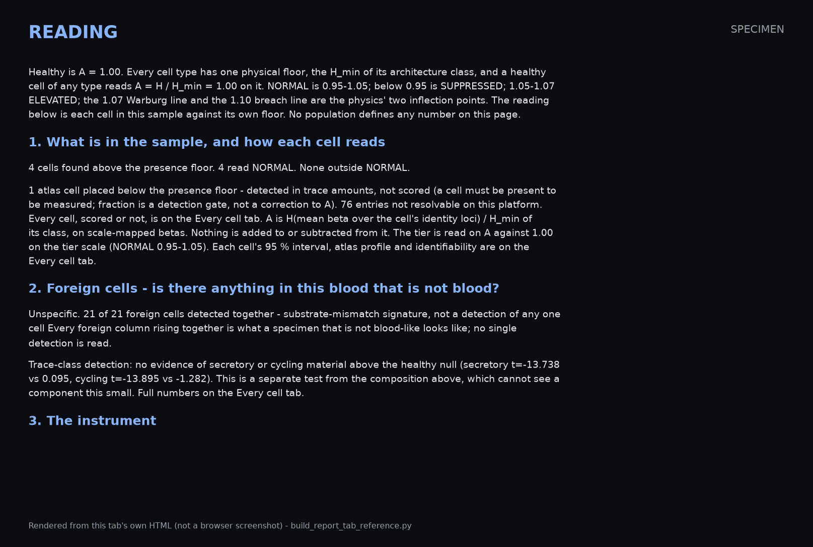

*5 KB, 2 tables, 10 rows.*  Sections: **Reading - REFERENCE**, **1. What is in the sample, and how each cell reads**, **2. Foreign cells - is there anything in this blood that is not blood?**, **3. The instrument**

### How to read  ·  `howto`  ·  REFERENCE

How to read the gauge: what A measures, what each tier means, and what A = 1.00 is and is not.

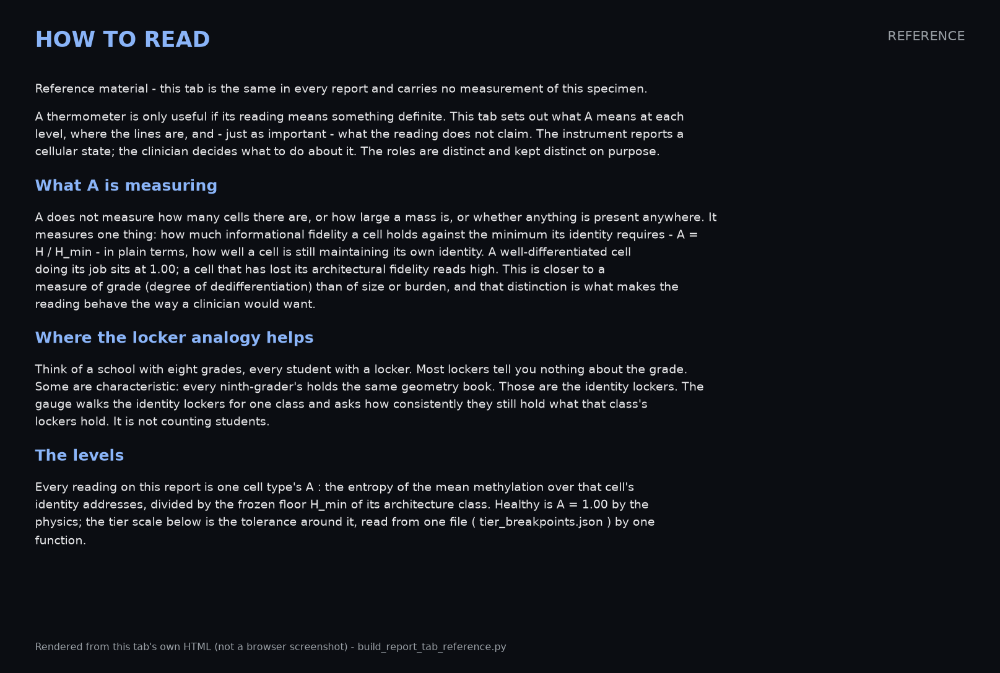

*15 KB, 3 tables, 18 rows.*  Sections: **How to read the gauge**, **What A is measuring**, **The test for any number on this report**, **Where the locker analogy helps**, **The levels**, **Age**, **Two different things, and neither is A = 1.00 sitting on a floor**, **The saturation wall chart - 8 classes x 5 substrates**

### Cells  ·  `cells`  ·  SPECIMEN

Every atlas cell, scored or not: each cell's A on its own identity loci with its interval and how many of its loci the array read, then the trace detection of anything non-blood, and what limits a claim about one cell.

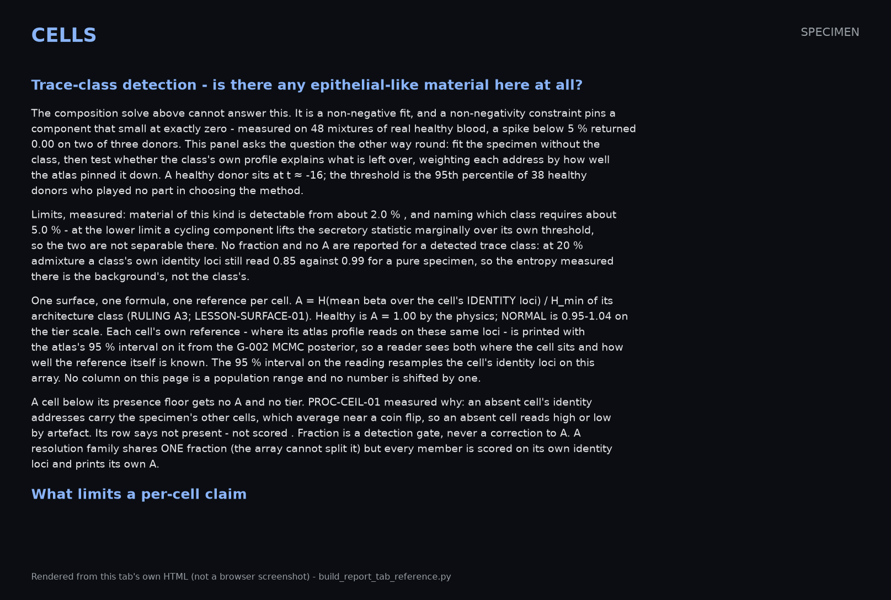

*32 KB, 12 tables, 90 rows.*  Sections: **Every cell - all 115 atlas cell types**, **Trace-class detection - is there any epithelial-like material here at all?**, **What limits a per-cell claim**, **Foreign-cell detection (Stage 2d)**, **Stem (pluripotent) (1 cells; H_min 0.9822)**, **Stem (adult) (1 cells; H_min 0.8737)**, **Progenitor (11 cells; H_min 0.8522)**, **Cycling epithelial (19 cells; H_min 0.8561)**

### Sky  ·  `sky`  ·  SPECIMEN

The sky: a Mollweide plate of this specimen's own residuals - its methylation at each address minus what its own composition predicts - with the statistics behind the plate. Compared to no picture of anyone else.

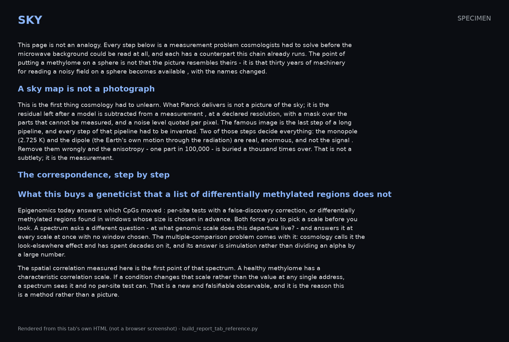

*5785 KB, 3 tables, 23 rows.*  Sections: **The sky - what it is, why it is a cosmologist's object, and what it buys a geneticist**, **A sky map is not a photograph**, **The correspondence, step by step**, **What this buys a geneticist that a list of differentially methylated regions does not**, **One thing a geneticist has that a cosmologist would trade almost anything for**, **What else the MCMC gives us, and what we are not yet using**, **Brilliance - the first tool taken from cosmology, and where it went**, **Two maps from one patient - the difference map**

### Physics  ·  `physics`  ·  REFERENCE

The physics under the gauge: Landauer's bound, the entropy floor H_min, and why the zero is a fixed point rather than a group of people.

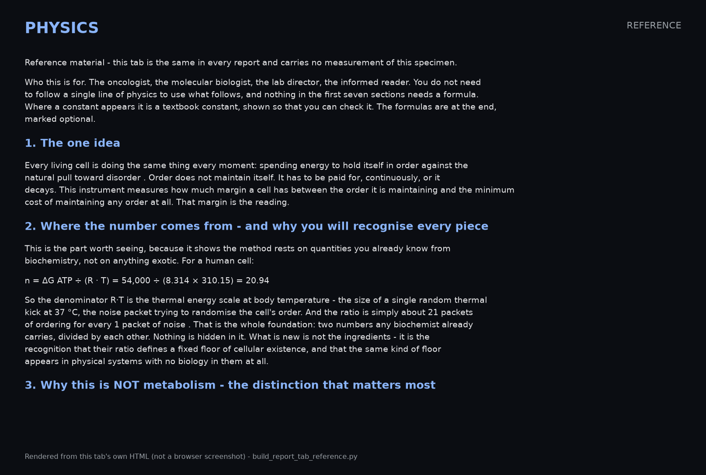

*19 KB, 4 tables, 16 rows.*  Sections: **The physics, in plain language**, **1. The one idea**, **2. Where the number comes from - and why you will recognise every piece**, **3. Why this is NOT metabolism - the distinction that matters most**, **4. Three things, not two**, **5. Eight sandcastles on one beach**, **6. Tidiness has a number, and the reading is a ratio**, **7. The same floor appears far outside biology - which is why we trust it**

### Story  ·  `story`  ·  REFERENCE

What astro-genetics is, in the author's words, with a link to the paper.

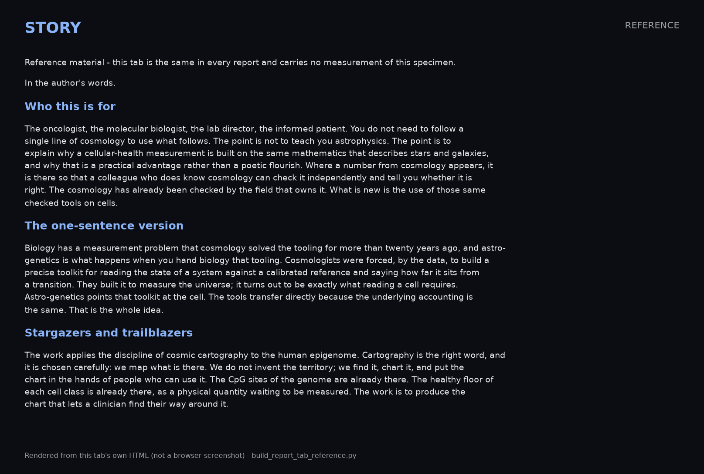

*377 KB, 0 tables, 0 rows.*  Sections: **What is astro-genetics?**, **Who this is for**, **The one-sentence version**, **Stargazers and trailblazers**, **Why your cells follow the same rule as the stars**, **Where the gauge sits, and what is open to inspection**, **Two names, and which is which**

### Reference  ·  `reference`  ·  REFERENCE

The instrument: its physical constants (the eight floors - a cell's class names the floor it is divided by, nothing else) and what a laboratory's array needs before a reading is taken.

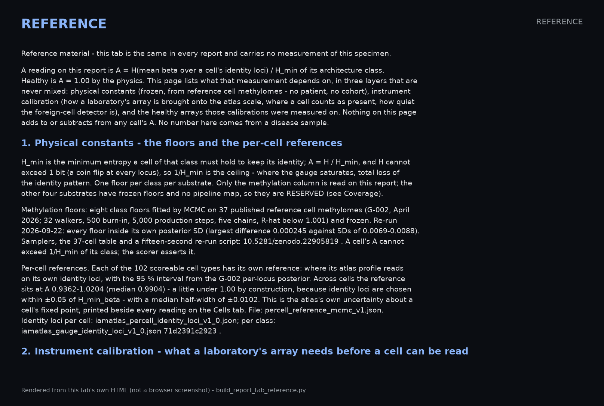

*6 KB, 2 tables, 15 rows.*  Sections: **The instrument - its constants and its calibration**, **1. Physical constants - the floors**, **2. Instrument calibration - what a laboratory's array needs before a cell can be read**

### Coverage  ·  `coverage`  ·  REFERENCE

What is lit and what is reserved: the five substrates, the specimen types, and what lighting one cell requires.

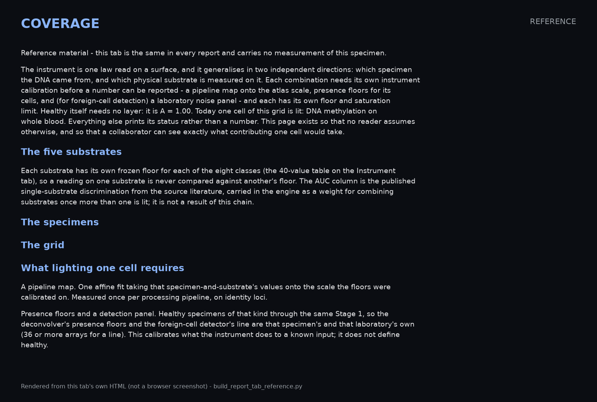

*7 KB, 3 tables, 22 rows.*  Sections: **Coverage - what is lit, what is reserved, and what each one needs**, **The five substrates**, **The specimens**, **The grid**, **What lighting one cell requires**

### Red flags  ·  `flags`  ·  SPECIMEN

Red flags: everything this run refused, withheld or could not measure, in one place, ordered by severity - STOP, WITHHELD, CAUTION, NOTE.

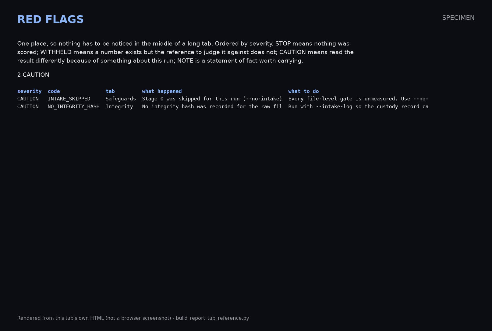

*1 KB, 1 tables, 3 rows.*  Sections: **Red flags - everything this run refused, withheld or could not measure**

### Safeguards  ·  `safeguards`  ·  SPECIMEN

Every guard and whether it passed on this specimen, with the Stage 0 custody record.

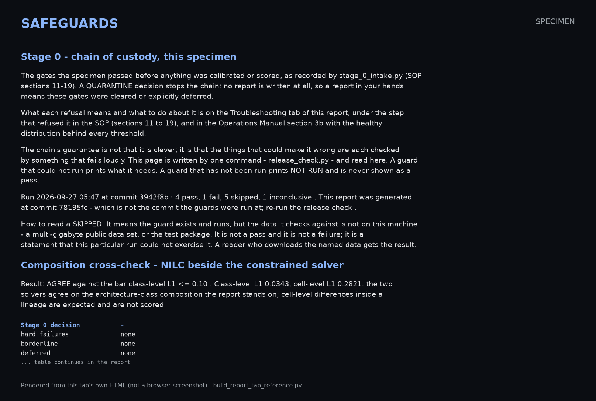

*17 KB, 4 tables, 54 rows.*  Sections: **Safeguards - every guard, and whether it passed**, **Stage 0 - chain of custody, this specimen**, **Composition cross-check - NILC beside the constrained solver**, **The cosmology toolkit, and what it did on this specimen**

### Troubleshooting  ·  `trouble`  ·  REFERENCE

Troubleshooting: every refusal the chain can print, what it means, and what the operator does.

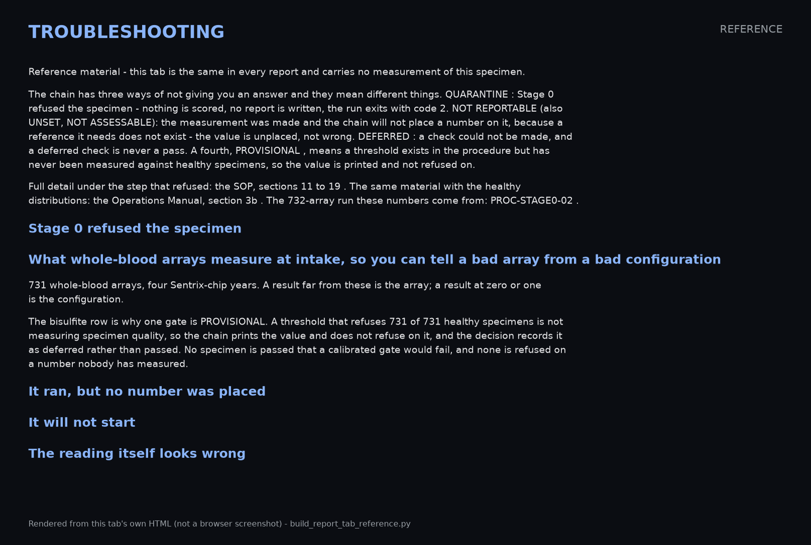

*10 KB, 5 tables, 31 rows.*  Sections: **Troubleshooting - what each refusal means, and what to do**, **Stage 0 refused the specimen**, **What whole-blood arrays measure at intake, so you can tell a bad array from a bad configuration**, **It ran, but no number was placed**, **It will not start**, **The reading itself looks wrong**, **Foreign-cell detection (Stage 2d) printed something you did not expect**, **How these were found, which is how to look for yours**

### Integrity  ·  `integrity`  ·  SPECIMEN

The fail-safes that kept this reading honest: what this run refused and why, each safeguard with its cosmology twin, the instrument constants this run read, and every file it read with its hash.

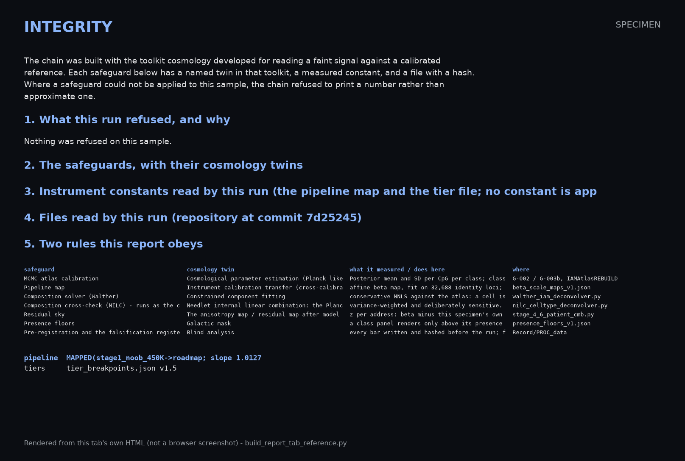

*16 KB, 3 tables, 52 rows.*  Sections: **Integrity - the fail-safes that kept this reading honest, and what each one measured**, **1. What this run refused, and why**, **2. The safeguards, with their cosmology twins**, **3. Instrument constants read by this run (the pipeline map and the tier file; no constant is applied to any cell's A)**, **4. Files read by this run (repository at commit 5f8704d)**, **5. Two rules this report obeys**

### Chain  ·  `chain`  ·  REFERENCE

The chain that produced the reading, stage by stage, derived from the code rather than described - so a stage cannot be claimed that the code does not call.

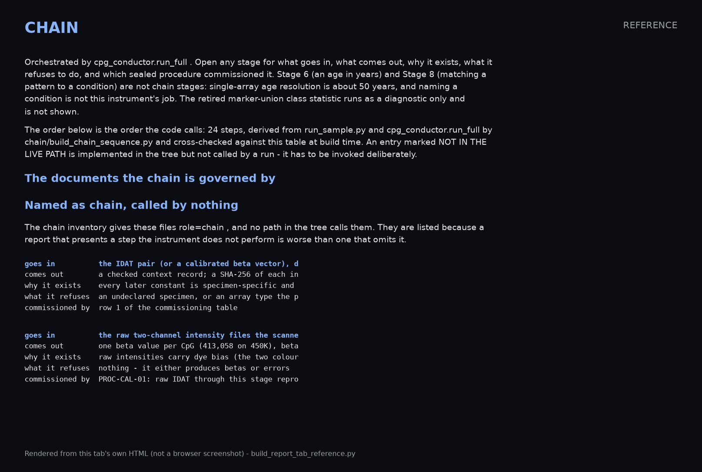

*26 KB, 18 tables, 91 rows.*  Sections: **The chain - every stage this report came from**, **The documents the chain is governed by**, **Named as chain, called by nothing**

### Files  ·  `files`  ·  REFERENCE

Every file the chain uses, enumerated from the live tree with its role and SHA-256.

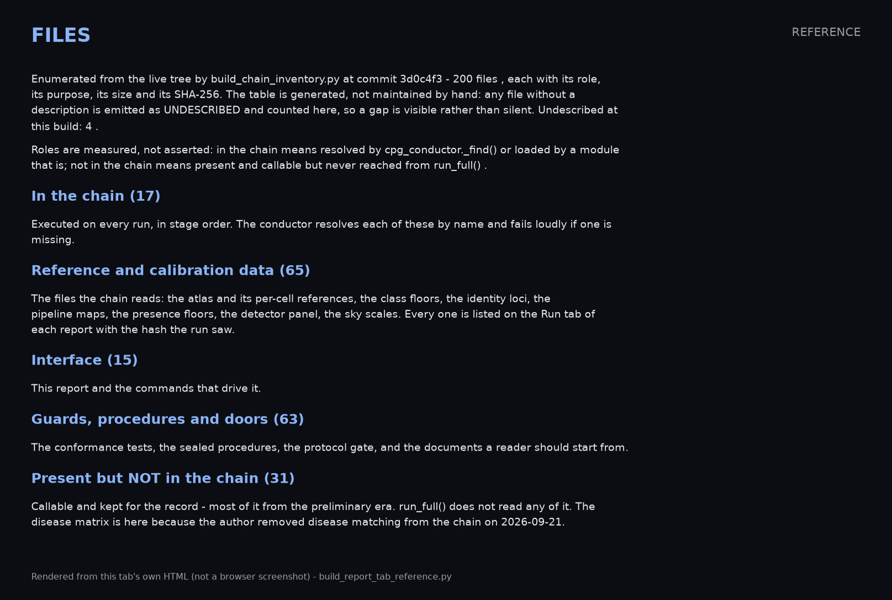

*84 KB, 6 tables, 201 rows.*  Sections: **Every file the chain uses**, **In the chain (17)**, **Reference and calibration data (65)**, **Interface (15)**, **Guards, procedures and doors (63)**, **Present but NOT in the chain (31)**, **Superseded (4)**

### Findings  ·  `findings`  ·  REFERENCE

Findings that changed a reported number, with the procedure that sealed each.

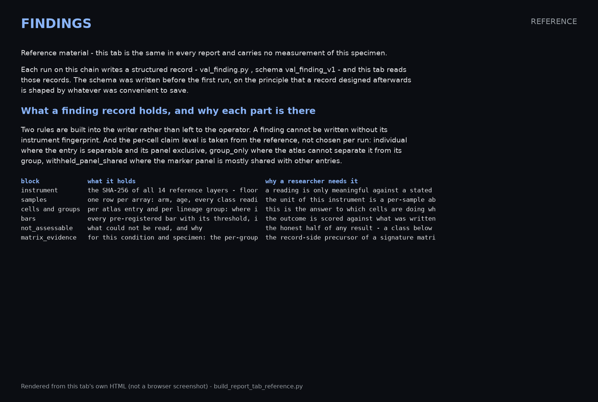

*4 KB, 1 tables, 7 rows.*  Sections: **Validation findings**, **What a finding record holds, and why each part is there**

### Record  ·  `record`  ·  REFERENCE

The validation record: every series and sealed procedure, linked.

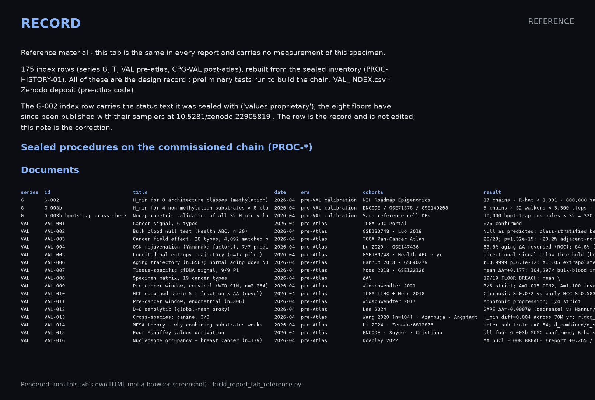

*52 KB, 2 tables, 200 rows.*  Sections: **Record - every validation and every sealed procedure, linked**, **Sealed procedures on the commissioned chain (PROC-*)**, **Documents**

### Run  ·  `run`  ·  SPECIMEN

Run it yourself: what produced this reading (chain commit, a hash of every input) and how to clone, verify and run the chain.

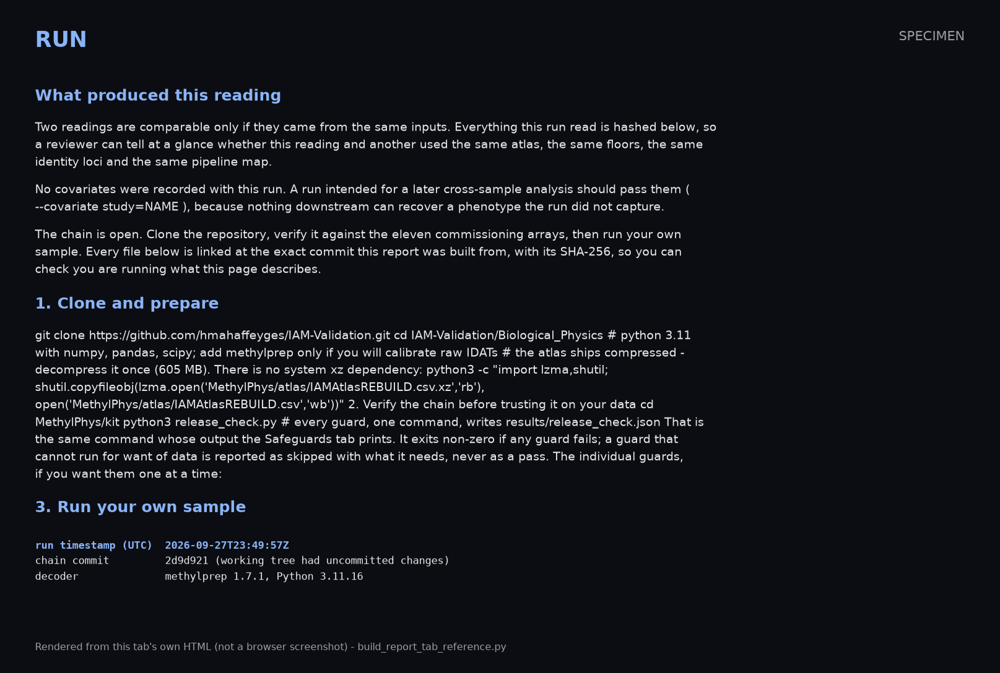

*16 KB, 7 tables, 59 rows.*  Sections: **Run it yourself**, **What produced this reading**, **1. Clone and prepare**, **2. Verify the chain before trusting it on your data**, **3. Run your own sample**, **4. What the chain needs from you, and what it will refuse**, **5. Commissioning your own laboratory**, **Files this run read - checked against the repository at render time**

## The CMB tool register, as it reads on this specimen

Every method borrowed from CMB analysis, with a check that runs on the finished bundle. A FAIL is also emitted to Red flags as `CMB_TOOL_FAIL`. **NOT_BUILT entries are listed on purpose** - the shelf is part of the record, and [`ENHANCEMENTS.md`](ENHANCEMENTS.md) ranks them.

| state | method |
|---|---|
| `NOT_BUILT` | angular power spectrum of the residual sky |
| `NOT_BUILT` | apodised mask instead of a binary presence floor |
| `NOT_BUILT` | beam smoothing |
| `NOT_BUILT` | cross-spectra between class panels |
| `NOT_BUILT` | degeneracy and Fisher analysis of the composition |
| `NOT_BUILT` | difference map between two draws |
| `NOT_BUILT` | full cell-type covariance in the separation |
| `NOT_BUILT` | internal linear combination on the residual sky |
| `NOT_BUILT` | per-patient posterior for the composition |
| `NOT_RUN` | surface brightness |
| `PASS` | HEALPix pixelisation |
| `PASS` | Mollweide plate of the residual sky |
| `PASS` | inverse-variance matched-template detection of a foreign cell |
| `PASS` | inverse-variance weighting |
| `PASS` | masking what the instrument cannot see |
| `PASS` | needlet internal linear combination |
| `PASS` | residual against a measured zero and scale |

To add a tool: append one entry to `TOOLS` in [`cmb_tools.py`](../chain/cmb_tools.py) with a `check(bundle)`. The table, the counts and the red-flag routing all follow.
