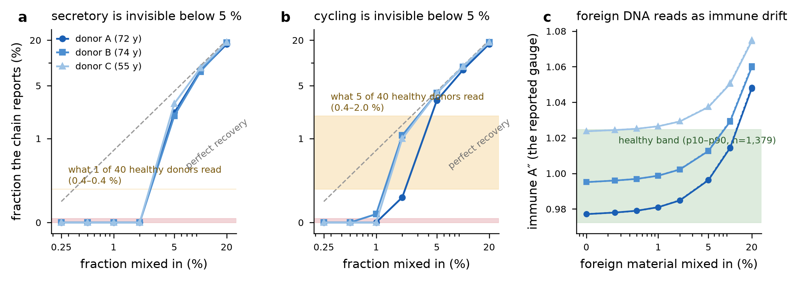

# Can this chain see secretory or cycling material in ordinary whole blood?

**Dated working note, 2026-09-23.** Two measurements, run because the author asked whether the small classes
could be scored from a routine blood draw — if they can, the substrate problem largely goes away. This is
characterisation of the instrument, not a test against a bar, so it is a note and not a pre-registration. No
disease cohort was opened: the matrix is healthy blood and the spike is an atlas reference profile.

Scripts: [`floor_scan.py`](floor_scan.py), [`dilution.py`](dilution.py), [`floor_lod_analyse.py`](floor_lod_analyse.py).
Evidence: [`FLOOR_SCAN_40_healthy.json`](results/FLOOR_SCAN_40_healthy.json),
[`LOD_dilution_48_mixtures.json`](results/LOD_dilution_48_mixtures.json).

## 1. The healthy null - 40 Uppsala donors, every class-level value including the floor-masked ones

| class | donors with any weight | median % | max % | at or above its presence floor |
|---|---|---|---|---|
| immune | 40/40 | 88.0 | 97.1 | 40 |
| progenitor | 29/40 | 12.0 | 20.7 | 29 |
| stem_adult | 30/40 | 3.3 | 9.2 | 22 |
| terminal | 22/40 | 1.0 | 1.9 | **0** |
| stem_pluri | 9/40 | 1.0 | 2.9 | 1 |
| cycling | 5/40 | 1.6 | 2.0 | 1 |
| secretory | 1/40 | 0.4 | 0.4 | **0** |
| stromal | 0/40 | - | - | 0 |

So the author was right that non-immune material appears in healthy whole blood, and the earlier statement
that these classes are simply absent was wrong. Terminal takes weight in more than half the donors. What no
blood cohort shows is any of them clearing its presence floor: terminal never, secretory never, cycling once
in forty.

The two solvers disagree on 8 of 40 donors (L1 between them: median 0.057, max 0.199), and they disagree
about exactly these small components - the needlet solver reports secretory in 5 donors where the class-level
solve reports it in 1, and reads immune 7 points higher on average.

## 2. The limit of detection - 48 mixtures, real blood with a reference class mixed in

Each mixture is a real healthy array with a known fraction of the class's reference profile combined at the
beta level. What the chain recovers:

| mixed in | secretory recovered (3 donors) | cycling recovered (3 donors) |
|---|---|---|
| 0.25 % | 0.0, 0.0, 0.0 | 0.0, 0.0, 0.0 |
| 0.50 % | 0.0, 0.0, 0.0 | 0.0, 0.0, 0.0 |
| 1.0 % | 0.0, 0.0, 0.0 | 0.0, 0.0, 0.1 |
| 2.0 % | 0.0, 0.0, 0.0 | 0.3, 1.0, 1.1 |
| 5.0 % | 2.0, 2.2, 2.9 | 3.2, 4.0, 4.0 |
| 10 % | 7.7, 7.9, 8.6 | 8.1, 8.9, 9.0 |
| 20 % | 17.7, 18.6, 18.7 | 17.8, 18.7, 18.8 |

**Limit of detection: 5 % for both classes** - the smallest spike recovered above every donor's zero-spike
reading on every donor. Below 2 % the estimate is exactly zero, and recovery is biased low until about 10 %
(a 5 % component reads as 2-4 %).

**The mechanism is the estimator, not the data.** Two of the three donors read *exactly* 0.00 at every spike
under 5 %: the non-negativity constraint pins a small component at the boundary, and a boundary solution
cannot respond to a small change. The third donor, whose solution sits in the interior (needlet secretory
1.66 % at zero spike), responds monotonically to every step - 1.66, 1.73, 1.81, 1.94, 2.19, 2.96, 4.16,
7.88 % across the series. The sensitivity is there; what destroys it is a point estimate at a boundary and a
large offset. That is what the next round of work targets.

**What this means for the healthy null.** The 0.4-2.0 % readings in section 1 sit *below* the demonstrated
detection limit. They are therefore not yet evidence of real trace populations - they are in the regime where
this chain cannot separate a small component from zero. Nothing about a trace class in blood should be
reported until the limit comes down.

## 3. Two findings that matter now

**A foreign component reads as immune drift.** Immune A'' is not invariant to composition: across these
mixtures it moved from 0.9771 to 1.0749, about 0.003 per 1 % of foreign material, which is 0.15 sigma of the
healthy band per 1 %. At 20 % foreign material every donor read ABOVE_BAND on a gauge that is meant to report
immune fidelity. A specimen with unusual composition can therefore be called departed for a reason that has
nothing to do with immune architecture. The composition is already printed beside the reading, but nothing
currently flags this coupling. **Roadmap item, and a candidate refusal:** when non-haematopoietic fraction
exceeds a bound to be measured, the immune tier should be withheld rather than printed.

**A trace class cannot be scored in blood, and now we know by how much.** A pure secretory specimen would
read A = 0.9937 on secretory identity loci. In blood those same loci read 0.807 at zero spike and only 0.851
at a 20 % spike, because at 20 % admixture they still carry 80 % immune DNA. Detecting the *fraction* and
scoring the class's *A* are different problems, and the second is out of reach in this substrate at any
fraction a blood draw will present. Fraction is the tractable target.
