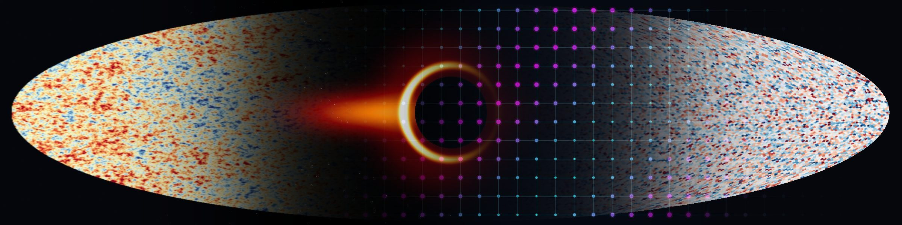

<p align="center"><a href="https://hmahaffeyges.github.io/IAM-Validation/"></a></p>

# IAM's Law and Order

**The Actualization of Reality** — *The Cost of Recording It, and the Price of Maintaining It.*

**One law of physics from the qubit to the genome to the cosmic horizon.**

<p align="center">
  <a href="https://hmahaffeyges.github.io/IAM-Validation/"></a>
  <a href="https://hmahaffeyges.github.io/IAM-Validation/pdf/IAMs_Law_and_Order.pdf"></a>
  <a href="https://hmahaffeyges.github.io/IAM-Validation/epub/IAMs_Law_and_Order.epub"></a>
  <a href="https://github.com/hmahaffeyges/IAM-Validation/releases/download/v1.0.0/IAMs_Law_and_Order_LaTeX_source_v1.0.0.zip"></a>
  <a href="https://hmahaffeyges.github.io/IAM-Validation/"></a>
</p>

Heath W. Mahaffey, IAMPerformance (independent research).

**Cite the book (version 1.0, October 2026):** Mahaffey, H. W. *IAM's Law and Order: The Actualization of Reality.* Zenodo. [https://doi.org/10.5281/zenodo.23151068](https://doi.org/10.5281/zenodo.23151068)

[](https://doi.org/10.5281/zenodo.23151068) [](https://doi.org/10.17605/OSF.IO/KCZD9) [](https://doi.org/10.5281/zenodo.18702042) [](https://opensource.org/licenses/MIT)

## IAM's Law

Every irreversible transition pays a thermodynamic cost at the nearest encoding surface: `k_B T ln 2` per bit, at that surface's own
temperature. The cost cannot be recovered or engineered away. Different substrates expose it differently; the law is the same.
The cost is Landauer's and has been measured; the surface and its temperature are Bekenstein's and Hawking's; Jacobson showed that
gravity follows from the thermodynamics of such surfaces.

## What IAM is

The Informational Actualization Model is a testable set of equations inside general relativity, the piece Jacobson's thermodynamic
derivation of Einstein's equations left open. At the cosmic horizon it fixes a late-time coupling with no free parameter: IAM fits the
Planck CMB as well as ΛCDM and predicts slower growth of structure with lensing unchanged, a test Euclid and DESI will make. In the
cell, the same price per bit sets a floor under how faithfully a methylation pattern can be copied, and an instrument in development
reads each cell against that floor and against its own healthy state. The substrate changes. The noise changes. The measured inputs
change. The thermodynamic accounting does not.

## Try to break it

`python3 docs/book/verify_book.py` checks every derivation and calculated number in the book. Found something wrong? Open an issue
with the "I tried to break it" template ([`CONTRIBUTING.md`](CONTRIBUTING.md)).

## Why pick it up

- **For a cosmologist:** one parameter-free line fixes `μ_0`, the `fσ_8` ramp, `Σ = 1`, `E_G`, `S_8` and the two Hubble rates together, and
  the full Planck likelihood with the coupling fixed fits as well as ΛCDM. The surveys now running measure its size.
- **For a quantum physicist:** a gate error and a quasiparticle density have a thermal floor at the device's own temperature, from
  `k_B T ln 2` alone. The book gives the physics, with makers' published device values as illustrations.
- **For a geneticist:** the methylation pattern is a record a cell pays to keep. Each cell type is read against its own healthy state,
  so one person can be measured, measured again, and compared with themselves.

Every claim carries one status label (DERIVED, CALCULATED, CALIBRATED, MEASURED, OBSERVED, FITTED, CONJECTURE, PREDICTION or OPEN), and
every number in the book is recomputed by a script in this repository. The invitation is to try to break it.

## Start here

| what | where |
|---|---|
| **The book**, *IAM's Law and Order* (seven parts, LaTeX, compiles as-is in Overleaf) | [`docs/book/`](docs/book/) — open `main.tex` |
| Corrections to every source paper (authoritative where a paper and this list disagree) | [`docs/verification/PAPER_ERRATA.md`](docs/verification/PAPER_ERRATA.md) |
| Every constant and name, defined once | [`CANON/GLOSSARY.md`](CANON/GLOSSARY.md) (generated from `CANON/iam_canon.json`; `python3 CANON/canon_check.py`) |
| Every prediction, with its test and status | the book's predictions chapter and register appendix; source list [`CANON/predictions_register.csv`](CANON/predictions_register.csv) |
| Recomputation scripts for the book's numbers | [`docs/verification/scripts/`](docs/verification/scripts/) |
| Check every derivation in the book | [`docs/book/verify_book.py`](docs/book/verify_book.py): `python3 docs/book/verify_book.py` (results and inventory in [`docs/book/verification/`](docs/book/verification/)) |
| Cosmology and gravitation | [`Cosmological_Physics/`](Cosmological_Physics/) — Level 1 and Level 2 chains, data, early tests |
| Cellular physics | [`Biological_Physics/`](Biological_Physics/) — the cell instrument (chain v3, in development): SOP, operations manual, toolkit |
| Quantum and particle physics | [`Quantum_and_Particle_Physics/`](Quantum_and_Particle_Physics/) — the scripts behind Parts IV and V |
| Development logs | [`development/`](development/) — every development finding, one running log per project |

## Results, with their status

| place | result | status |
|---|---|---|
| cosmic horizon | matter-sector coupling `β_m = Ω_m/2 = 0.15765`, so `μ(0) = 0.864` (`μ_0 = −0.136`), `Σ = 1` | DERIVED (from the partition), CALCULATED |
| cosmic horizon | Planck 2018 fit with the coupling fixed: `Δχ² = +0.54` against ΛCDM; `σ_8` 0.8087 → 0.7998 | MEASURED (chains) |
| cosmic horizon | `fσ_8` 4.25 % below ΛCDM today, 2.17 % at z = 0.3, 0.41 % at z = 1; lensing unchanged | CALCULATED; PREDICTION |
| cosmic horizon | two Hubble rates: 67.16 (light) and 72.26 = 67.161·√1.1575 km/s/Mpc (matter flow) | CALCULATED; PREDICTION |
| cosmic horizon | putting the term in the background instead moves `H_0` to 61.5 (10.9σ): the background does not change in IAM | MEASURED (chains) |
| surveys | growth surveys through the mid-2030s reach about 2.5–3σ on the deficit with the CMB fixing the early amplitude; DESI DR2 full shape is next | CALCULATED (Fisher forecast) |
| black holes | horizon bits priced at the horizon's temperature total `½Mc²` (Smarr) | DERIVED |
| qubits | thermal floor of a transmon gate at its own temperature, from `k_B T ln 2` | DERIVED, CALCULATED |
| chips | Ryzen 9 9950X switches at 576–593 × `k_B T_j ln 2` (published TDP, clock and transistor count) | CALCULATED |
| cells | neutrophils read against their own healthy reference: held out, spread 0.020 around 1 | CALIBRATED, MEASURED |
| cells | reference atlas v2: 74 purified healthy cell types built as one Bayesian posterior (NUTS, about 814,000 loci) across seven public sources on arrays and sequencing, with an interval at every locus for every cell; held-out values fall inside the stated 90 % interval 92.7 % of the time. To our knowledge, the first cell-type methylation reference built this way | MEASURED |
| cells | DNMT1 blocked, tumour against the same patient's normal tissue, species ageing | development records (`doors/`), not yet commissioned |

The cell instrument is being commissioned stage by stage: base chain first, then atlas deconvolution, NILC, per-cell readings,
directional decomposition and the sky tools. Each stage enters the chain only after its own check passes; the order and status are in the
SOP, section 2b.

## The papers

The book is the one current text. The papers it was built from were written and shared along the way; they are not kept in this
repository, because the book corrects and supersedes them. Every correction, with the original passage beside the corrected one, is in
[`docs/verification/PAPER_ERRATA.md`](docs/verification/PAPER_ERRATA.md). The originals remain public on
[OSF](https://doi.org/10.17605/OSF.IO/KCZD9) and [Zenodo](https://doi.org/10.5281/zenodo.18702042).

## Reproduce

**Check the book's derivations in one command:** `python3 docs/book/verify_book.py`. Every derivation and calculated number in the book is checked and passes (4,674 checks, 0 failures), in the book's order, each with its equation label (`--part N`, `--label L`, `--fails`, `--json`).

**Development logs:** every development finding, good or bad, is logged as it happens in [`development/`](development/), one running log per project (Met-A, IAM-A and C-scores; wild versus hatchery fish). The book carries results once the chain that produced them is commissioned.


```
git clone https://github.com/hmahaffeyges/IAM-Validation && cd IAM-Validation
pip install numpy scipy pandas matplotlib
python3 CANON/canon_check.py                                   # constants and names consistent
python3 docs/verification/scripts/verify_encoding_ladder.py    # the encoding surfaces; see the Saturation appendix's identity table
```
The cell chain is run as in [`Biological_Physics/MethylPhys/README.md`](Biological_Physics/MethylPhys/README.md) and its operations manual;
`python3 Biological_Physics/MethylPhys/kit/release_check.py` checks it end to end. The book compiles with `pdflatex`/`bibtex` (or Overleaf)
from [`docs/book/main.tex`](docs/book/main.tex).

## Citation

```bibtex
@misc{Mahaffey2026,
  author    = {Mahaffey, Heath W.},
  title     = {Dual-Sector Cosmology from Structure-Driven Expansion: The Informational Actualization Model},
  year      = {2026},
  publisher = {Zenodo},
  doi       = {10.5281/zenodo.18702042},
  url       = {https://doi.org/10.5281/zenodo.18702042}
}
```

## Contact

Heath W. Mahaffey, IAMPerformance (independent research). Email: hmahaffeyges@gmail.com. GitHub: [@hmahaffeyges](https://github.com/hmahaffeyges).
Questions, checks and replications are welcome as GitHub issues.

## License

MIT. See [LICENSE](LICENSE).

## Acknowledgements

The work rests on Landauer, Bennett, Bekenstein, Hawking, Gibbons, Jacobson, Cai and Kim, and Zurek. Data: the Planck, SDSS/BOSS/eBOSS,
SH0ES, Pantheon+, DESI, KiDS and DES collaborations, and the authors of every public methylation data set read here (named in each
record). Software: CAMB (Lewis, Challinor), MGCAMB (Wang, Mirpoorian, Pogosian, Silvestri, Zhao), Cobaya (Torrado, Lewis), HEALPix, NumPy,
SciPy, Matplotlib, GetDist.

---

*I den frie forskers tradition — i taknemmelighed for dem, der gik forud.*  
*In the tradition of the independent researcher — in gratitude to those who came before.*

Heath W. Mahaffey, IAMPerformance (independent research). He lived and studied in Denmark and the Faroe Islands, where independent
research (*fri forskning*) is an old and respected tradition; the work is offered in that spirit. Collaborators are welcome: see
[`CONTRIBUTING.md`](CONTRIBUTING.md).
